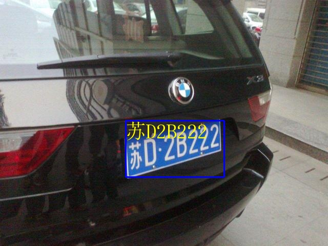

# 又快又准的中国车牌识别
```
git clone  -b main https://github.com/h030162/PlateRecognition.git
cd PlateRecognition
pip install -r requirements.txt
python plate_rec.py --image_path ./test_plate/hcqccip6335913.jpg
```
测试图片:
```
python ./plate_rec.py --image_path .\test_plate\hcqccip6335913.jpg
```


测试速度:
```
python ./plate_rec.py --speed_test True
```
```
avgtime cost: 11.376379504443246ms [{'text': '苏D2B222', 'score_text': 0.9999972581863403, 'bbox': [245, 235, 437, 345], 'score_bbox': 0.8730417490005493}]
avgtime cost: 11.376340859756837ms [{'text': '粤A63N9S', 'score_text': 0.9999688267707825, 'bbox': [248, 509, 440, 598], 'score_bbox': 0.8173306584358215}]
avgtime cost: 11.376326672999246ms [{'text': '苏A6PQ33', 'score_text': 0.9999929070472717, 'bbox': [786, 1026, 1213, 1197], 'score_bbox': 0.8369861841201782}]
```
如果使用tensorrt和tritonserver, 应该还有提速空间